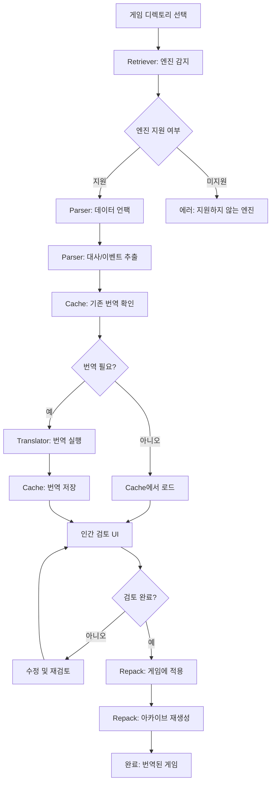

# HayoTrans - 게임 번역 도구 전체 아키텍처

## 프로젝트 개요

**HayoTrans**는 다양한 게임 엔진으로 제작된 게임을 번역하는 종합 번역 도구입니다.

### 지원 게임 엔진
- **RPG Maker**: XP, VX, VX Ace, MV, MZ
- **KiriKiri**: 일부 지원 (향후 확장)
- **기타 V8 기반 엔진**: Nw.js, Electron 등

### 핵심 기능
1. 게임 엔진 자동 감지
2. 게임 데이터 언팩 및 파싱
3. 기계번역 및 AI 문맥 인식 번역
4. 번역 캐시 관리 (인간 검토 지원)
5. 번역된 게임 재패키징

## 시스템 아키텍처

### 5대 핵심 모듈

```
HayoTrans
├── Retriever   (게임 엔진 감지 및 프로젝트 정보 추출)
├── Parser      (게임 데이터 언팩 및 파싱)
├── Translator  (번역 엔진)
├── Cache       (번역 캐시 관리)
└── Repack      (게임 재패키징)
```

## 모듈별 상세 설계

### 1. Retriever (검색기)

**목적**: 게임 디렉토리를 분석하여 게임 엔진 타입과 버전을 감지

#### 주요 기능
- 파일 시스템 스캔
- 게임 엔진 시그니처 감지
- 프로젝트 메타데이터 추출

#### 감지 전략

##### RPG Maker 감지
```rust
pub enum RpgMakerVersion {
    XP,      // .rgssad, Game.rxproj
    VX,      // .rgss2a, Game.rvproj
    VXAce,   // .rgss3a, Game.rvproj2
    MV,      // www/data/, package.json with "rpg_core"
    MZ,      // www/data/, package.json with "rmmz_core"
}

// 감지 방법
// 1. 프로젝트 파일 존재 확인 (.rxproj, .rvproj, .rvproj2)
// 2. 데이터 아카이브 확인 (.rgssad, .rgss2a, .rgss3a)
// 3. package.json 분석 (MV/MZ)
// 4. www/data/ 디렉토리 구조 확인
```

##### KiriKiri 감지
```rust
pub enum KiriKiriVersion {
    KAG3,    // .xp3 archives, data.xp3
    Z,       // 최신 버전
}

// 감지 방법
// 1. .xp3 아카이브 파일 존재
// 2. krkr.exe 또는 krkrz.exe 실행 파일
// 3. startup.tjs 스크립트 파일
```

##### V8 기반 엔진 감지
```rust
pub enum V8Engine {
    NwJs,      // package.json with "nw"
    Electron,  // package.json with "electron"
    Generic,   // 기타 V8 엔진
}

// 감지 방법
// 1. package.json 분석
// 2. nw.exe, electron.exe 실행 파일
// 3. resources/app.asar 존재 (Electron)
```

#### 데이터 구조
```rust
#[derive(Debug, Clone, Serialize, Deserialize)]
pub struct GameProject {
    pub id: String,
    pub path: PathBuf,
    pub engine: GameEngine,
    pub version: String,
    pub metadata: ProjectMetadata,
}

#[derive(Debug, Clone, Serialize, Deserialize)]
pub enum GameEngine {
    RpgMaker(RpgMakerVersion),
    KiriKiri(KiriKiriVersion),
    V8Engine(V8Engine),
    Unknown,
}

#[derive(Debug, Clone, Serialize, Deserialize)]
pub struct ProjectMetadata {
    pub title: Option<String>,
    pub author: Option<String>,
    pub language: Option<String>,
    pub encoding: Option<String>,
}
```

### 2. Parser (파서)

**목적**: 게임 데이터를 언팩하고 번역 가능한 텍스트를 추출

#### 주요 기능
- 아카이브 언팩 (.rgssad, .xp3, .asar 등)
- 대사 추출
- 이벤트 스크립트 파싱
- 플러그인/스크립트 분석

#### 엔진별 파서

##### RPG Maker Parser
```rust
pub trait RpgMakerParser {
    fn unpack_archive(&self, path: &Path) -> Result<Vec<GameFile>>;
    fn parse_map_data(&self, data: &[u8]) -> Result<Vec<DialogueLine>>;
    fn parse_common_events(&self, data: &[u8]) -> Result<Vec<EventData>>;
    fn parse_plugins(&self, path: &Path) -> Result<Vec<PluginData>>;
}

// XP/VX/VXAce: Marshal 포맷 (Ruby)
// MV/MZ: JSON 포맷
```

##### KiriKiri Parser
```rust
pub trait KiriKiriParser {
    fn unpack_xp3(&self, path: &Path) -> Result<Vec<GameFile>>;
    fn parse_scenario(&self, data: &[u8]) -> Result<Vec<DialogueLine>>;
    fn parse_tjs_script(&self, data: &[u8]) -> Result<Vec<ScriptData>>;
}
```

#### 데이터 구조
```rust
#[derive(Debug, Clone, Serialize, Deserialize)]
pub struct DialogueLine {
    pub id: String,
    pub file: String,
    pub line_number: usize,
    pub speaker: Option<String>,
    pub original_text: String,
    pub context: DialogueContext,
}

#[derive(Debug, Clone, Serialize, Deserialize)]
pub struct DialogueContext {
    pub map_name: Option<String>,
    pub event_name: Option<String>,
    pub preceding_lines: Vec<String>,
    pub tags: Vec<String>,
}

#[derive(Debug, Clone, Serialize, Deserialize)]
pub struct EventData {
    pub id: String,
    pub name: String,
    pub commands: Vec<EventCommand>,
}

#[derive(Debug, Clone, Serialize, Deserialize)]
pub struct PluginData {
    pub name: String,
    pub version: String,
    pub parameters: serde_json::Value,
}
```

### 3. Translator (번역기)

**목적**: 추출된 텍스트를 번역

#### 번역 엔진 타입

##### 1. 기계번역 엔진
```rust
pub trait MachineTranslator {
    async fn translate(&self, text: &str, from: &str, to: &str) -> Result<String>;
    async fn translate_batch(&self, texts: Vec<&str>, from: &str, to: &str) -> Result<Vec<String>>;
}

// 구현체
pub struct GcpTranslator {
    api_key: String,
    project_id: String,
}

pub struct EzTransConnector {
    host: String,
    port: u16,
}
```

##### 2. AI 문맥 인식 번역
```rust
pub trait ContextAwareTranslator {
    async fn translate_with_context(
        &self,
        dialogue: &DialogueLine,
        story_context: &StoryContext,
        map_context: &MapContext,
    ) -> Result<String>;
}

pub struct OpenAiTranslator {
    api_key: String,
    base_url: String,  // OpenAI Compatible API
    model: String,
}

#[derive(Debug, Clone, Serialize, Deserialize)]
pub struct StoryContext {
    pub summary: String,
    pub characters: Vec<Character>,
    pub current_chapter: Option<String>,
}

#[derive(Debug, Clone, Serialize, Deserialize)]
pub struct MapContext {
    pub map_name: String,
    pub location_type: LocationType,
    pub atmosphere: Option<String>,
}
```

#### 번역 전략
```rust
#[derive(Debug, Clone, Serialize, Deserialize)]
pub enum TranslationStrategy {
    MachineOnly,           // 기계번역만
    AiOnly,                // AI 번역만
    Hybrid {               // 하이브리드
        machine_first: bool,
        ai_review: bool,
    },
}
```

### 4. Cache (캐시)

**목적**: 번역 결과를 저장하고 인간 검토를 지원

#### 주요 기능
- 번역 결과 저장
- 버전 관리
- 인간 검토 워크플로우
- 재사용 가능한 번역 메모리

#### 데이터 구조
```rust
#[derive(Debug, Clone, Serialize, Deserialize)]
pub struct TranslationCache {
    pub project_id: String,
    pub entries: Vec<CacheEntry>,
    pub metadata: CacheMetadata,
}

#[derive(Debug, Clone, Serialize, Deserialize)]
pub struct CacheEntry {
    pub id: String,
    pub dialogue_id: String,
    pub original_text: String,
    pub translated_text: String,
    pub translator: TranslatorType,
    pub status: ReviewStatus,
    pub created_at: DateTime<Utc>,
    pub updated_at: DateTime<Utc>,
    pub reviewed_by: Option<String>,
    pub notes: Option<String>,
}

#[derive(Debug, Clone, Serialize, Deserialize)]
pub enum ReviewStatus {
    Pending,        // 검토 대기
    Approved,       // 승인됨
    NeedsRevision,  // 수정 필요
    Rejected,       // 거부됨
}

#[derive(Debug, Clone, Serialize, Deserialize)]
pub enum TranslatorType {
    Gcp,
    EzTrans,
    OpenAi,
    Human,
}
```

#### 저장 방식
```rust
// SQLite 데이터베이스 사용
pub struct CacheDatabase {
    conn: rusqlite::Connection,
}

// 또는 JSON 파일 기반
pub struct JsonCache {
    cache_dir: PathBuf,
}
```

### 5. Repack (재패키징)

**목적**: 번역된 텍스트를 게임에 적용하고 재패키징

#### 주요 기능
- 번역된 텍스트를 게임 데이터에 적용
- 아카이브 재생성
- 게임 실행 가능 상태로 복원
- 백업 생성

#### 엔진별 재패키징
```rust
pub trait Repacker {
    fn apply_translations(&self, project: &GameProject, cache: &TranslationCache) -> Result<()>;
    fn repack_archive(&self, files: Vec<GameFile>, output: &Path) -> Result<()>;
    fn create_backup(&self, project: &GameProject) -> Result<PathBuf>;
}

// RPG Maker XP/VX/VXAce: Marshal 재직렬화
// RPG Maker MV/MZ: JSON 재작성
// KiriKiri: XP3 재패키징
```

## 전체 워크플로우



## Rust 프로젝트 구조

```
src-tauri/src/
├── main.rs
├── lib.rs
├── retriever/
│   ├── mod.rs
│   ├── detector.rs          (엔진 감지)
│   ├── rpg_maker.rs         (RPG Maker 감지)
│   ├── kirikiri.rs          (KiriKiri 감지)
│   └── v8_engine.rs         (V8 엔진 감지)
├── parser/
│   ├── mod.rs
│   ├── rpg_maker/
│   │   ├── mod.rs
│   │   ├── marshal.rs       (XP/VX/VXAce Marshal 파서)
│   │   └── json.rs          (MV/MZ JSON 파서)
│   ├── kirikiri/
│   │   ├── mod.rs
│   │   ├── xp3.rs           (XP3 언팩)
│   │   └── scenario.rs      (시나리오 파싱)
│   └── common.rs            (공통 파싱 유틸)
├── translator/
│   ├── mod.rs
│   ├── machine/
│   │   ├── mod.rs
│   │   ├── gcp.rs           (Google Cloud Translation)
│   │   └── eztrans.rs       (ezTrans 연동)
│   ├── ai/
│   │   ├── mod.rs
│   │   └── openai.rs        (OpenAI Compatible API)
│   └── strategy.rs          (번역 전략)
├── cache/
│   ├── mod.rs
│   ├── database.rs          (SQLite 캐시)
│   ├── json.rs              (JSON 캐시)
│   └── review.rs            (검토 워크플로우)
├── repack/
│   ├── mod.rs
│   ├── rpg_maker.rs         (RPG Maker 재패키징)
│   ├── kirikiri.rs          (KiriKiri 재패키징)
│   └── backup.rs            (백업 관리)
├── types/
│   ├── mod.rs
│   ├── engine.rs            (게임 엔진 타입)
│   ├── dialogue.rs          (대사 타입)
│   ├── translation.rs       (번역 타입)
│   └── error.rs             (에러 타입)
└── commands/
    ├── mod.rs
    ├── retriever.rs         (Retriever Tauri commands)
    ├── parser.rs            (Parser Tauri commands)
    ├── translator.rs        (Translator Tauri commands)
    ├── cache.rs             (Cache Tauri commands)
    └── repack.rs            (Repack Tauri commands)
```

## 프론트엔드 구조

```
src/
├── App.tsx
├── index.tsx
├── types/
│   ├── engine.ts
│   ├── dialogue.ts
│   ├── translation.ts
│   └── cache.ts
├── components/
│   ├── ProjectSelector.tsx      (프로젝트 선택)
│   ├── EngineDetector.tsx       (엔진 감지 결과)
│   ├── DialogueList.tsx         (대사 목록)
│   ├── TranslationEditor.tsx    (번역 편집기)
│   ├── ReviewPanel.tsx          (검토 패널)
│   └── ProgressTracker.tsx      (진행 상황)
├── pages/
│   ├── Home.tsx
│   ├── Project.tsx
│   ├── Translation.tsx
│   ├── Review.tsx
│   └── Export.tsx
├── services/
│   ├── api.ts                   (Tauri API 래퍼)
│   ├── project.ts
│   ├── translation.ts
│   └── cache.ts
└── utils/
    ├── format.ts
    └── validation.ts
```

## 필요한 Rust Crates

```toml
[dependencies]
# Tauri
tauri = { version = "2", features = [] }
tauri-plugin-fs = "2"
tauri-plugin-dialog = "2"
tauri-plugin-notification = "2"

# 직렬화
serde = { version = "1", features = ["derive"] }
serde_json = "1"

# 에러 처리
thiserror = "1"
anyhow = "1"

# 비동기
tokio = { version = "1", features = ["full"] }
async-trait = "0.1"

# HTTP 클라이언트 (번역 API)
reqwest = { version = "0.11", features = ["json"] }

# 데이터베이스
rusqlite = { version = "0.30", features = ["bundled"] }

# 날짜/시간
chrono = { version = "0.4", features = ["serde"] }

# 파일 압축/아카이브
zip = "0.6"
flate2 = "1"

# 인코딩
encoding_rs = "0.8"

# Ruby Marshal 파싱 (RPG Maker XP/VX/VXAce)
# 커스텀 구현 필요 또는 기존 crate 사용

# 로깅
tracing = "0.1"
tracing-subscriber = "0.3"
```

## 필요한 NPM 패키지

```json
{
  "dependencies": {
    "@tauri-apps/api": "^2",
    "@tauri-apps/plugin-dialog": "^2",
    "@tauri-apps/plugin-fs": "^2",
    "solid-js": "^1.9.3"
  },
  "devDependencies": {
    "@tauri-apps/cli": "^2",
    "typescript": "~5.6.2",
    "vite": "^6.0.3",
    "vite-plugin-solid": "^2.11.0"
  }
}
```

## 데이터베이스 스키마 (SQLite)

```sql
-- 프로젝트 테이블
CREATE TABLE projects (
    id TEXT PRIMARY KEY,
    path TEXT NOT NULL,
    engine TEXT NOT NULL,
    version TEXT NOT NULL,
    title TEXT,
    created_at DATETIME DEFAULT CURRENT_TIMESTAMP,
    updated_at DATETIME DEFAULT CURRENT_TIMESTAMP
);

-- 대사 테이블
CREATE TABLE dialogues (
    id TEXT PRIMARY KEY,
    project_id TEXT NOT NULL,
    file TEXT NOT NULL,
    line_number INTEGER NOT NULL,
    speaker TEXT,
    original_text TEXT NOT NULL,
    context_json TEXT,
    created_at DATETIME DEFAULT CURRENT_TIMESTAMP,
    FOREIGN KEY (project_id) REFERENCES projects(id)
);

-- 번역 캐시 테이블
CREATE TABLE translations (
    id TEXT PRIMARY KEY,
    dialogue_id TEXT NOT NULL,
    translated_text TEXT NOT NULL,
    translator TEXT NOT NULL,
    status TEXT NOT NULL DEFAULT 'pending',
    created_at DATETIME DEFAULT CURRENT_TIMESTAMP,
    updated_at DATETIME DEFAULT CURRENT_TIMESTAMP,
    reviewed_by TEXT,
    notes TEXT,
    FOREIGN KEY (dialogue_id) REFERENCES dialogues(id)
);

-- 번역 히스토리 테이블
CREATE TABLE translation_history (
    id INTEGER PRIMARY KEY AUTOINCREMENT,
    translation_id TEXT NOT NULL,
    translated_text TEXT NOT NULL,
    translator TEXT NOT NULL,
    created_at DATETIME DEFAULT CURRENT_TIMESTAMP,
    FOREIGN KEY (translation_id) REFERENCES translations(id)
);

-- 인덱스
CREATE INDEX idx_dialogues_project ON dialogues(project_id);
CREATE INDEX idx_translations_dialogue ON translations(dialogue_id);
CREATE INDEX idx_translations_status ON translations(status);
```

## 구현 우선순위

### Phase 1: 기본 인프라 (1-2주)
1. 프로젝트 구조 설정
2. 타입 정의 (types 모듈)
3. 에러 처리 시스템
4. 기본 Tauri commands

### Phase 2: Retriever (1주)
1. RPG Maker 감지 (XP/VX/VXAce/MV/MZ)
2. 프로젝트 메타데이터 추출
3. 프론트엔드 연동

### Phase 3: Parser - RPG Maker (2-3주)
1. MV/MZ JSON 파서 (우선)
2. XP/VX/VXAce Marshal 파서
3. 대사 추출
4. 이벤트 파싱

### Phase 4: Cache (1주)
1. SQLite 데이터베이스 설정
2. CRUD 작업
3. 검토 워크플로우

### Phase 5: Translator (2-3주)
1. GCP Translation API 연동
2. ezTrans 연동
3. OpenAI API 연동
4. 번역 전략 구현

### Phase 6: Repack (2주)
1. RPG Maker MV/MZ 재패키징
2. 백업 시스템
3. 검증 시스템

### Phase 7: 프론트엔드 UI (2-3주)
1. 프로젝트 관리 UI
2. 번역 편집기
3. 검토 패널
4. 진행 상황 추적

### Phase 8: 확장 (향후)
1. KiriKiri 지원
2. 기타 V8 엔진 지원
3. 고급 AI 번역 기능
4. 플러그인 시스템

## 보안 고려사항

1. **API 키 관리**: 환경 변수 또는 안전한 저장소 사용
2. **파일 시스템 접근**: Tauri의 scope 시스템 활용
3. **데이터 검증**: 모든 입력 데이터 검증
4. **백업**: 원본 게임 파일 자동 백업

## 성능 최적화

1. **병렬 처리**: 대량 번역 시 병렬 처리
2. **캐싱**: 번역 결과 캐싱으로 중복 번역 방지
3. **스트리밍**: 대용량 파일 스트리밍 처리
4. **인덱싱**: 데이터베이스 인덱스 최적화

## 테스트 전략

1. **단위 테스트**: 각 모듈별 단위 테스트
2. **통합 테스트**: 모듈 간 통합 테스트
3. **E2E 테스트**: 전체 워크플로우 테스트
4. **실제 게임 테스트**: 다양한 RPG Maker 게임으로 테스트
