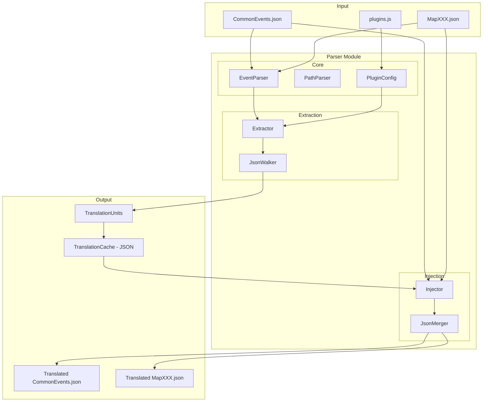
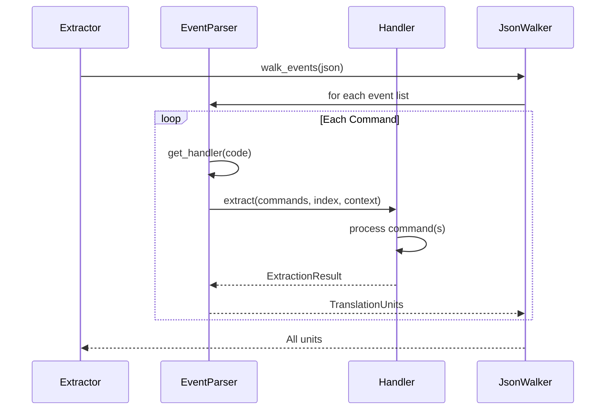

# RPG Maker MV/MZ Parser Architecture

## Overview

This document describes the architecture for the Parser module in HayoTrans, focusing on RPG Maker MV/MZ's CommonEvent and Map JSON files.

## Design Goals

1. **Clean Separation**: Decouple extraction logic from injection logic while sharing common definitions
2. **Type Safety**: Strong typing for event command codes and parameters
3. **Extensibility**: Support for user-configurable plugin extraction via UI
4. **No Global State**: Pure functional approach where possible
5. **Bidirectional**: Support both extraction and injection in a unified system

## Core Concepts

### TranslationUnit

A `TranslationUnit` represents a single translatable text with its location metadata:

```rust
pub struct TranslationUnit {
    /// Unique identifier for this translation unit
    pub id: String,
    /// Location path in the JSON structure (e.g., "events.5.pages.0.list.12")
    pub path: TranslationPath,
    /// Command code that produced this text (e.g., 401 for dialogue)
    pub code: EventCode,
    /// Original text to translate
    pub original: String,
    /// Optional speaker name (from code 101)
    pub speaker: Option<String>,
    /// Additional context for translation
    pub context: TranslationContext,
}
```

### TranslationPath

A structured path that can locate any value in the JSON:

```rust
pub struct TranslationPath {
    segments: Vec<PathSegment>,
}

pub enum PathSegment {
    /// Object key access (e.g., "events")
    Key(String),
    /// Array index access (e.g., [5])
    Index(usize),
    /// Parameter access within event command
    Parameter(usize),
}

impl TranslationPath {
    /// Create path from string like "events.5.pages.0.list.12.parameters.0"
    pub fn parse(s: &str) -> Result<Self>;
    
    /// Convert back to string representation
    pub fn to_string(&self) -> String;
    
    /// Get value at this path from JSON
    pub fn get<'a>(&self, json: &'a Value) -> Option<&'a Value>;
    
    /// Set value at this path in JSON
    pub fn set(&self, json: &mut Value, value: Value) -> Result<()>;
}
```

### EventCode

Strongly typed event command codes:

```rust
#[derive(Debug, Clone, Copy, PartialEq, Eq, Hash)]
#[repr(i32)]
pub enum EventCode {
    // Core Dialogue Codes
    ShowText = 101,           // Actor/speaker info
    ShowTextBody = 401,       // Dialogue text content
    ShowScrollingText = 105,  // Scrolling text header
    ScrollingTextBody = 405,  // Scrolling text content
    Comment = 108,            // Comment header
    CommentBody = 408,        // Comment continuation
    
    // Choice Codes
    ShowChoices = 102,        // Choice options
    WhenChoice = 402,         // Choice branch
    WhenCancel = 403,         // Cancel branch
    ChoicesEnd = 404,         // End of choices
    
    // Name Input
    InputNumber = 103,
    SelectItem = 104,
    
    // Plugin Related
    PluginCommand = 357,      // MV plugin command
    PluginCommandMZ = 357,    // MZ plugin command (same code, different format)
    
    // Script
    Script = 355,
    ScriptBody = 655,
    
    // Other translatable
    ChangeNickname = 324,
    ChangeProfile = 325,
    
    // Unknown/Custom
    Unknown(i32),
}

impl From<i32> for EventCode {
    fn from(code: i32) -> Self {
        match code {
            101 => Self::ShowText,
            401 => Self::ShowTextBody,
            // ... etc
            other => Self::Unknown(other),
        }
    }
}
```

## Architecture Diagram



## Module Structure

```
src-tauri/src/parser/
├── mod.rs                 # Module exports
├── types/
│   ├── mod.rs
│   ├── event_code.rs      # EventCode enum
│   ├── translation_unit.rs # TranslationUnit struct
│   ├── translation_path.rs # TranslationPath for JSON navigation
│   └── context.rs         # TranslationContext
├── rpg_maker_mv_mz/
│   ├── mod.rs
│   ├── common_events.rs   # CommonEvents.json parser
│   ├── map.rs             # MapXXX.json parser
│   ├── event_page.rs      # Shared page/list parsing logic
│   ├── plugin_config.rs   # Plugin extraction configuration
│   └── handlers/
│       ├── mod.rs
│       ├── dialogue.rs    # 101, 401 handlers
│       ├── choices.rs     # 102, 402 handlers
│       ├── comment.rs     # 108, 408 handlers
│       └── plugin.rs      # 357 handler
├── extraction/
│   ├── mod.rs
│   ├── extractor.rs       # Main extraction logic
│   └── walker.rs          # JSON tree walker
└── injection/
    ├── mod.rs
    ├── injector.rs        # Main injection logic
    └── merger.rs          # JSON merge logic
```

## Core Components

### 1. EventParser

Parses event command lists and dispatches to appropriate handlers:

```rust
pub struct EventParser {
    handlers: HashMap<EventCode, Box<dyn CommandHandler>>,
}

pub trait CommandHandler: Send + Sync {
    /// Checks if this handler can process the command
    fn can_handle(&self, code: EventCode) -> bool;
    
    /// Extract translation units from command(s)
    /// May consume multiple consecutive commands (e.g., 401 blocks)
    fn extract(
        &self,
        commands: &[EventCommand],
        index: usize,
        path_prefix: &TranslationPath,
        context: &mut ExtractionContext,
    ) -> Result<ExtractionResult>;
    
    /// Inject translations back into command(s)
    fn inject(
        &self,
        commands: &mut [EventCommand],
        index: usize,
        translations: &HashMap<String, String>,
        path_prefix: &TranslationPath,
    ) -> Result<usize>;
}

pub struct ExtractionResult {
    /// Translation units extracted
    pub units: Vec<TranslationUnit>,
    /// Number of commands consumed
    pub consumed: usize,
    /// Updated speaker (if applicable)
    pub speaker: Option<String>,
}
```

### 2. DialogueHandler (401)

Handles the most common case - dialogue text:

```rust
pub struct DialogueHandler;

impl CommandHandler for DialogueHandler {
    fn extract(
        &self,
        commands: &[EventCommand],
        index: usize,
        path_prefix: &TranslationPath,
        context: &mut ExtractionContext,
    ) -> Result<ExtractionResult> {
        let mut lines = Vec::new();
        let mut consumed = 0;
        let indent = commands[index].indent;
        
        // Collect consecutive 401 commands with same indent
        while index + consumed < commands.len() {
            let cmd = &commands[index + consumed];
            if cmd.code != 401 || cmd.indent != indent {
                break;
            }
            if let Some(text) = cmd.parameters.get(0).and_then(|v| v.as_str()) {
                lines.push(text.to_string());
            }
            consumed += 1;
        }
        
        // Merge lines into single translation unit
        let merged_text = lines.join("\n");
        let unit_id = generate_unit_id(path_prefix, index);
        
        Ok(ExtractionResult {
            units: vec![TranslationUnit {
                id: unit_id,
                path: path_prefix.append_index(index),
                code: EventCode::ShowTextBody,
                original: merged_text,
                speaker: context.current_speaker.clone(),
                context: context.to_translation_context(),
            }],
            consumed,
            speaker: None,
        })
    }
    
    fn inject(
        &self,
        commands: &mut [EventCommand],
        index: usize,
        translations: &HashMap<String, String>,
        path_prefix: &TranslationPath,
    ) -> Result<usize> {
        let unit_id = generate_unit_id(path_prefix, index);
        
        if let Some(translated) = translations.get(&unit_id) {
            let lines: Vec<&str> = translated.lines().collect();
            let indent = commands[index].indent;
            
            // Count existing 401 blocks to remove
            let mut old_count = 0;
            while index + old_count < commands.len()
                && commands[index + old_count].code == 401
                && commands[index + old_count].indent == indent
            {
                old_count += 1;
            }
            
            // Create new 401 commands for translated lines
            let new_commands: Vec<EventCommand> = lines.iter().map(|line| {
                EventCommand {
                    code: 401,
                    indent,
                    parameters: vec![Value::String(line.to_string())],
                }
            }).collect();
            
            // Replace commands
            commands.splice(index..index + old_count, new_commands.clone());
            
            return Ok(new_commands.len());
        }
        
        Ok(1) // No translation, keep original
    }
}
```

### 3. PluginConfig - User Configurable Extraction

For plugins, users can define which fields to extract:

```rust
#[derive(Debug, Clone, Serialize, Deserialize)]
pub struct PluginExtractionConfig {
    /// Plugin name (e.g., "QuestSystem")
    pub plugin_name: String,
    /// List of paths to extract from plugin parameters
    pub extraction_paths: Vec<PluginFieldPath>,
    /// Whether this config is enabled
    pub enabled: bool,
}

#[derive(Debug, Clone, Serialize, Deserialize)]
pub struct PluginFieldPath {
    /// Path pattern like "QuestDatas.|ARY|.Title"
    pub pattern: String,
    /// Human-readable description
    pub description: Option<String>,
    /// Whether this field is translatable
    pub translatable: bool,
}

impl PluginFieldPath {
    /// Convert pattern to regex for matching
    pub fn to_matcher(&self) -> PathMatcher;
    
    /// Check if a concrete path matches this pattern
    pub fn matches(&self, path: &str) -> bool;
}

pub struct PathMatcher {
    regex: Regex,
}

impl PathMatcher {
    pub fn from_pattern(pattern: &str) -> Self {
        // Convert |ARY| to \d+ and |OBJ| to \w+
        let regex_str = pattern
            .replace(".", "\\.")
            .replace("|ARY|", r"\d+")
            .replace("|OBJ|", r"\w+");
        // ...
    }
}
```

### 4. PluginConfigStore

Manages both predefined and user-defined plugin configurations:

```rust
pub struct PluginConfigStore {
    /// Predefined configs (shipped with app)
    predefined: HashMap<String, PluginExtractionConfig>,
    /// User-defined configs
    user_defined: HashMap<String, PluginExtractionConfig>,
}

impl PluginConfigStore {
    /// Get config for a plugin, preferring user-defined over predefined
    pub fn get_config(&self, plugin_name: &str) -> Option<&PluginExtractionConfig>;
    
    /// Add or update user-defined config
    pub fn set_user_config(&mut self, config: PluginExtractionConfig);
    
    /// Get all known plugins
    pub fn list_plugins(&self) -> Vec<String>;
    
    /// Load configs from JSON file
    pub fn load_from_file(path: &Path) -> Result<Self>;
    
    /// Save user configs to JSON file
    pub fn save_to_file(&self, path: &Path) -> Result<()>;
}
```

### 5. Extractor - Main Extraction Interface

```rust
pub struct Extractor {
    event_parser: EventParser,
    plugin_config: PluginConfigStore,
}

impl Extractor {
    pub fn new() -> Self;
    
    /// Extract from CommonEvents.json
    pub fn extract_common_events(&self, json: &Value) -> Result<ExtractionOutput>;
    
    /// Extract from MapXXX.json
    pub fn extract_map(&self, json: &Value) -> Result<ExtractionOutput>;
    
    /// Extract from plugins.js (requires parsing JS first)
    pub fn extract_plugins(&self, json: &Value) -> Result<ExtractionOutput>;
}

pub struct ExtractionOutput {
    /// All extracted translation units
    pub units: Vec<TranslationUnit>,
    /// Metadata about extraction
    pub metadata: ExtractionMetadata,
    /// Any warnings encountered
    pub warnings: Vec<String>,
}

pub struct ExtractionMetadata {
    pub source_file: String,
    pub total_units: usize,
    pub speaker_list: Vec<String>,
    pub plugin_names: Vec<String>,
}
```

### 6. Injector - Main Injection Interface

```rust
pub struct Injector {
    event_parser: EventParser,
}

impl Injector {
    /// Inject translations into CommonEvents.json
    pub fn inject_common_events(
        &self,
        original: &mut Value,
        translations: &HashMap<String, String>,
    ) -> Result<InjectionOutput>;
    
    /// Inject translations into MapXXX.json
    pub fn inject_map(
        &self,
        original: &mut Value,
        translations: &HashMap<String, String>,
    ) -> Result<InjectionOutput>;
}

pub struct InjectionOutput {
    /// Number of translations applied
    pub applied: usize,
    /// Number of translations not found in original
    pub not_found: usize,
    /// Any warnings
    pub warnings: Vec<String>,
}
```

## Translation Cache Format

The extracted translations will be stored in JSON format for the frontend UI:

```json
{
  "version": "1.0",
  "source_file": "data/CommonEvents.json",
  "extracted_at": "2024-01-01T00:00:00Z",
  "units": [
    {
      "id": "ce.0.list.5_dialogue",
      "path": "events.0.pages.0.list.5",
      "code": 401,
      "original": "こんにちは！\n元気ですか？",
      "translated": null,
      "speaker": "村人A",
      "context": {
        "event_name": "Welcome Event",
        "preceding_lines": ["勇者は村に入った。"],
        "tags": ["greeting", "npc"]
      },
      "status": "pending"
    }
  ],
  "metadata": {
    "total_units": 150,
    "translated": 0,
    "reviewed": 0,
    "speakers": ["村人A", "村長", "勇者"]
  }
}
```

## Event Code Processing Flow



## Handling Consecutive Commands

One key improvement over the Python implementation is explicit handling of consecutive commands:

```rust
pub struct ExtractionContext {
    /// Current speaker from most recent 101 command
    pub current_speaker: Option<String>,
    /// Event name from page data
    pub event_name: Option<String>,
    /// Recent dialogue lines for context
    pub preceding_lines: VecDeque<String>,
    /// Maximum preceding lines to keep
    pub max_preceding: usize,
}

impl ExtractionContext {
    pub fn add_preceding_line(&mut self, line: String) {
        if self.preceding_lines.len() >= self.max_preceding {
            self.preceding_lines.pop_front();
        }
        self.preceding_lines.push_back(line);
    }
}
```

## Plugin UI Integration

For the frontend to allow users to configure plugin extraction:

```rust
/// Command to get plugin structure for UI inspection
#[tauri::command]
pub fn inspect_plugin_parameters(
    plugin_name: String,
    parameters: Value,
) -> Result<PluginStructure> {
    // Recursively analyze plugin parameter structure
    // Return tree structure for UI display
}

pub struct PluginStructure {
    pub fields: Vec<PluginField>,
}

pub struct PluginField {
    pub path: String,
    pub value_type: FieldType,
    pub sample_value: Option<String>,
    pub translatable: bool, // User can toggle this
    pub children: Vec<PluginField>,
}

pub enum FieldType {
    String,
    Number,
    Boolean,
    Array,
    Object,
    Null,
}
```

## Integration with Existing Types

### Using DialogueLine

The existing [`DialogueLine`](src-tauri/src/types/dialogue.rs:5) can be derived from `TranslationUnit`:

```rust
impl From<TranslationUnit> for DialogueLine {
    fn from(unit: TranslationUnit) -> Self {
        DialogueLine {
            id: unit.id,
            file: unit.path.to_string(),
            line_number: unit.path.get_line_number(),
            speaker: unit.speaker,
            original_text: unit.original,
            context: DialogueContext {
                map_name: unit.context.map_name,
                event_name: unit.context.event_name,
                preceding_lines: unit.context.preceding_lines,
                tags: unit.context.tags,
            },
        }
    }
}
```

### Using EventCommand

The existing [`EventCommand`](src-tauri/src/types/dialogue.rs:137) struct will be extended:

```rust
// Current definition 
pub struct EventCommand {
    pub code: i32,
    pub parameters: Vec<serde_json::Value>,
}

// Extended for parser
impl EventCommand {
    pub fn event_code(&self) -> EventCode {
        EventCode::from(self.code)
    }
    
    pub fn get_text_param(&self, index: usize) -> Option<&str> {
        self.parameters.get(index)?.as_str()
    }
}
```

## Error Handling

```rust
#[derive(Debug, thiserror::Error)]
pub enum ParserError {
    #[error("Invalid JSON structure: {0}")]
    InvalidStructure(String),
    
    #[error("Path not found: {0}")]
    PathNotFound(String),
    
    #[error("Invalid event command at {path}: {reason}")]
    InvalidCommand { path: String, reason: String },
    
    #[error("Unsupported event code: {0}")]
    UnsupportedCode(i32),
    
    #[error("Plugin config error: {0}")]
    PluginConfigError(String),
    
    #[error("IO error: {0}")]
    IoError(#[from] std::io::Error),
    
    #[error("JSON error: {0}")]
    JsonError(#[from] serde_json::Error),
}
```

## Implementation Priority

### Phase 1: Core Types and Paths
1. `EventCode` enum with all codes
2. `TranslationPath` with parse/get/set
3. `TranslationUnit` structure
4. `ExtractionContext`

### Phase 2: Core Handlers
1. `CommandHandler` trait
2. `DialogueHandler` (401)
3. `SpeakerHandler` (101)
4. `ChoicesHandler` (102, 402)
5. `CommentHandler` (408)

### Phase 3: Extraction Pipeline
1. `EventParser` with handler registration
2. `JsonWalker` for traversing structure
3. `Extractor` facade
4. CommonEvents extraction
5. Map extraction

### Phase 4: Injection Pipeline
1. Handler `inject` implementations
2. `JsonMerger` for safe value replacement
3. `Injector` facade

### Phase 5: Plugin System
1. `PluginExtractionConfig` types
2. `PluginConfigStore`
3. `PluginHandler` (357)
4. UI inspection commands
5. Predefined plugin configs

## Testing Strategy

```rust
#[cfg(test)]
mod tests {
    // Unit tests for each handler
    #[test]
    fn test_dialogue_extraction() {}
    
    // Integration tests with real JSON samples
    #[test]
    fn test_common_events_extraction() {}
    
    // Round-trip tests (extract -> inject)
    #[test]
    fn test_roundtrip_preserves_structure() {}
}
```

## Performance Considerations

1. **Lazy Parsing**: Only parse what's needed
2. **Path Caching**: Cache parsed paths for repeated operations
3. **Batch Operations**: Process multiple files in parallel
4. **Memory Efficient**: Stream large files when possible

## Security Considerations

1. **Path Validation**: Validate all TranslationPath operations
2. **Input Sanitization**: Sanitize text before injection
3. **Backup**: Always backup original files before injection
