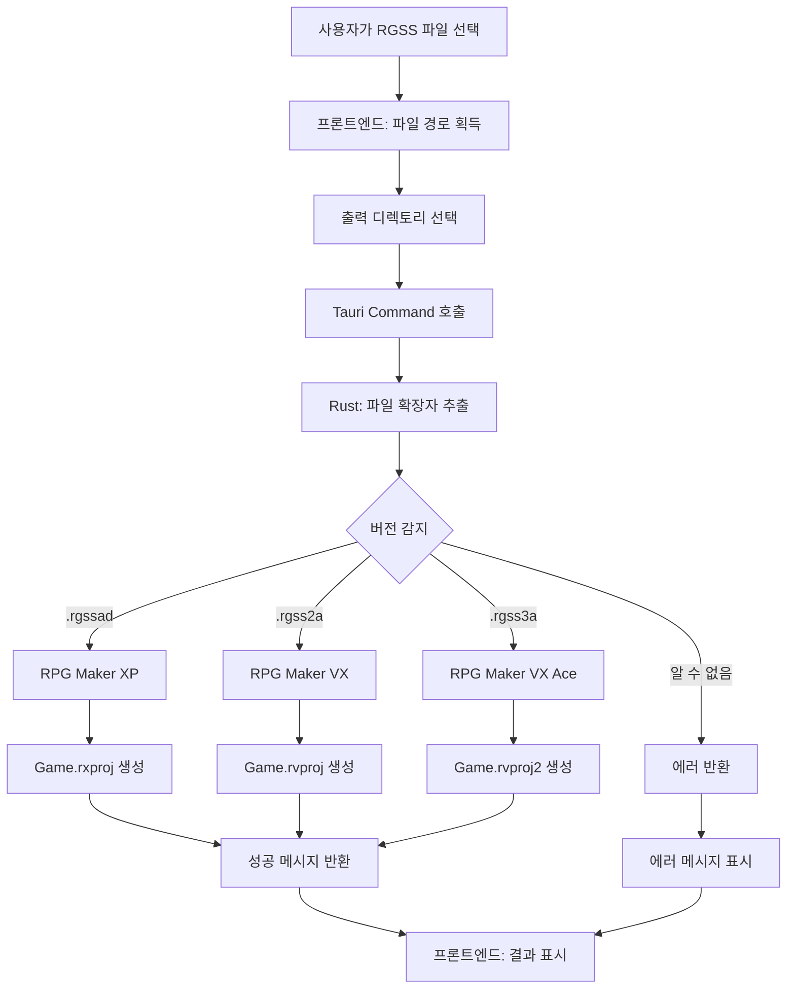
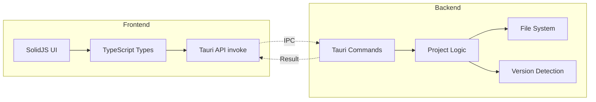

# RPG Maker 프로젝트 파일 생성 기능 구현 계획

## 프로젝트 개요

**HayoTrans**는 Tauri + SolidJS + TypeScript 기반의 데스크톱 애플리케이션입니다. 현재는 기본 템플릿 상태이며, RPG Maker 게임 데이터 파일을 처리하는 기능을 추가합니다.

## 목표

C# 코드를 Rust로 재구성하여 RPG Maker 프로젝트 파일(.rxproj, .rvproj, .rvproj2)을 생성하는 기능을 구현합니다.

## 아키텍처 설계

### 1. Rust 백엔드 구조

```
src-tauri/src/
├── main.rs              (진입점)
├── lib.rs               (Tauri 앱 설정 및 command 등록)
└── rpg_maker/           (새로 생성할 모듈)
    ├── mod.rs           (모듈 선언)
    ├── types.rs         (RPG Maker 버전 enum 및 타입)
    ├── project.rs       (프로젝트 파일 생성 로직)
    └── commands.rs      (Tauri commands)
```

### 2. 핵심 컴포넌트

#### RPG Maker 버전 Enum
```rust
pub enum RpgMakerVersion {
    XP,      // .rgssad
    VX,      // .rgss2a
    VXAce,   // .rgss3a
}
```

#### 프로젝트 파일 생성 함수
- **입력**: RGSS 데이터 파일 경로, 출력 디렉토리
- **출력**: 생성된 프로젝트 파일 경로 또는 에러
- **기능**: 파일 확장자 기반으로 버전 감지 및 적절한 프로젝트 파일 생성

### 3. 프론트엔드 구조

```
src/
├── App.tsx              (메인 UI 수정)
├── components/          (새로 생성)
│   └── RpgMakerExtractor.tsx
└── types/               (새로 생성)
    └── rpg-maker.ts     (TypeScript 타입 정의)
```

## 구현 세부사항

### Phase 1: Rust 백엔드 구현

#### 1. 모듈 구조 생성
- `src-tauri/src/rpg_maker/mod.rs` 생성
- 하위 모듈들을 public으로 노출

#### 2. 타입 정의 (types.rs)
```rust
#[derive(Debug, Clone, Copy, PartialEq, Eq)]
pub enum RpgMakerVersion {
    XP,
    VX,
    VXAce,
}

impl RpgMakerVersion {
    pub fn from_extension(ext: &str) -> Option<Self> {
        match ext.to_lowercase().as_str() {
            ".rgssad" => Some(Self::XP),
            ".rgss2a" => Some(Self::VX),
            ".rgss3a" => Some(Self::VXAce),
            _ => None,
        }
    }

    pub fn project_filename(&self) -> &str {
        match self {
            Self::XP => "Game.rxproj",
            Self::VX => "Game.rvproj",
            Self::VXAce => "Game.rvproj2",
        }
    }

    pub fn project_content(&self) -> &str {
        match self {
            Self::XP => "RPGXP 1.02",
            Self::VX => "RPGVX 1.02",
            Self::VXAce => "RPGVXAce 1.00",
        }
    }
}
```

#### 3. 에러 처리
```rust
#[derive(Debug, thiserror::Error)]
pub enum RpgMakerError {
    #[error("Unknown RPG Maker version for extension: {0}")]
    UnknownVersion(String),
    #[error("File not found: {0}")]
    FileNotFound(String),
    #[error("IO error: {0}")]
    IoError(#[from] std::io::Error),
}
```

#### 4. 프로젝트 파일 생성 로직 (project.rs)
```rust
use std::path::{Path, PathBuf};
use std::fs;

pub fn create_project_file(
    rgss_data_file: &str,
    out_dir: &str,
) -> Result<String, RpgMakerError> {
    // 1. 파일 확장자 추출
    let path = Path::new(rgss_data_file);
    let ext = path.extension()
        .and_then(|e| e.to_str())
        .map(|e| format!(".{}", e))
        .ok_or_else(|| RpgMakerError::UnknownVersion("No extension".to_string()))?;

    // 2. 버전 감지
    let version = RpgMakerVersion::from_extension(&ext)
        .ok_or_else(|| RpgMakerError::UnknownVersion(ext.clone()))?;

    // 3. 출력 경로 생성
    let output_path = PathBuf::from(out_dir)
        .join(version.project_filename());

    // 4. 파일 쓰기
    fs::write(&output_path, version.project_content())?;

    // 5. 생성된 파일 경로 반환
    Ok(output_path.to_string_lossy().to_string())
}
```

#### 5. Tauri Commands (commands.rs)
```rust
use serde::{Deserialize, Serialize};

#[derive(Serialize, Deserialize)]
pub struct CreateProjectResult {
    pub success: bool,
    pub message: String,
    pub project_file_path: Option<String>,
}

#[tauri::command]
pub fn create_rpg_maker_project(
    rgss_file: String,
    output_dir: String,
) -> CreateProjectResult {
    match create_project_file(&rgss_file, &output_dir) {
        Ok(path) => CreateProjectResult {
            success: true,
            message: format!("Project file created successfully"),
            project_file_path: Some(path),
        },
        Err(e) => CreateProjectResult {
            success: false,
            message: format!("Error: {}", e),
            project_file_path: None,
        },
    }
}
```

#### 6. lib.rs 업데이트
```rust
mod rpg_maker;

pub fn run() {
    tauri::Builder::default()
        .plugin(tauri_plugin_notification::init())
        .plugin(tauri_plugin_persisted_scope::init())
        .plugin(tauri_plugin_fs::init())
        .plugin(tauri_plugin_opener::init())
        .invoke_handler(tauri::generate_handler![
            greet,
            rpg_maker::commands::create_rpg_maker_project
        ])
        .run(tauri::generate_context!())
        .expect("error while running tauri application");
}
```

### Phase 2: 프론트엔드 구현

#### 7. TypeScript 타입 정의 (src/types/rpg-maker.ts)
```typescript
export interface CreateProjectResult {
  success: boolean;
  message: string;
  project_file_path?: string;
}

export type RpgMakerVersion = 'XP' | 'VX' | 'VXAce';
```

#### 8. UI 컴포넌트 (src/components/RpgMakerExtractor.tsx)
```typescript
import { createSignal } from "solid-js";
import { invoke } from "@tauri-apps/api/core";
import { open } from "@tauri-apps/plugin-dialog";
import type { CreateProjectResult } from "../types/rpg-maker";

export function RpgMakerExtractor() {
  const [result, setResult] = createSignal<string>("");
  const [loading, setLoading] = createSignal(false);

  async function selectAndProcess() {
    setLoading(true);
    try {
      // 파일 선택
      const file = await open({
        multiple: false,
        filters: [{
          name: 'RPG Maker Data',
          extensions: ['rgssad', 'rgss2a', 'rgss3a']
        }]
      });

      if (!file) {
        setResult("No file selected");
        return;
      }

      // 출력 디렉토리 선택
      const outputDir = await open({
        directory: true,
        multiple: false,
      });

      if (!outputDir) {
        setResult("No output directory selected");
        return;
      }

      // Rust 함수 호출
      const response = await invoke<CreateProjectResult>(
        "create_rpg_maker_project",
        {
          rgssFile: file,
          outputDir: outputDir,
        }
      );

      if (response.success) {
        setResult(`Success! Project file created at: ${response.project_file_path}`);
      } else {
        setResult(`Error: ${response.message}`);
      }
    } catch (error) {
      setResult(`Error: ${error}`);
    } finally {
      setLoading(false);
    }
  }

  return (
    <div>
      <h2>RPG Maker Project File Generator</h2>
      <button onClick={selectAndProcess} disabled={loading()}>
        {loading() ? "Processing..." : "Select RGSS File"}
      </button>
      <p>{result()}</p>
    </div>
  );
}
```

#### 9. App.tsx 통합
```typescript
import { RpgMakerExtractor } from "./components/RpgMakerExtractor";

function App() {
  return (
    <main class="container">
      <h1>HayoTrans</h1>
      <RpgMakerExtractor />
    </main>
  );
}
```

### Phase 3: 테스트 및 검증

#### 10. 테스트 케이스
- RPG Maker XP (.rgssad) 파일 처리
- RPG Maker VX (.rgss2a) 파일 처리
- RPG Maker VX Ace (.rgss3a) 파일 처리
- 잘못된 파일 확장자 처리
- 파일 시스템 에러 처리

## 기술적 고려사항

### 파일 시스템 권한
- Tauri의 `tauri-plugin-fs` 사용하여 안전한 파일 접근
- 이미 프로젝트에 포함되어 있음

### 크로스 플랫폼 호환성
- `std::path::Path`와 `PathBuf` 사용으로 Windows/macOS/Linux 지원
- 경로 구분자 자동 처리

### 의존성 추가 필요
- `thiserror` crate (에러 처리)
- `@tauri-apps/plugin-dialog` (파일 선택 다이얼로그)

## 파일 매핑 테이블

| 확장자 | 버전 | 프로젝트 파일명 | 내용 |
|--------|------|----------------|------|
| `.rgssad` | RPG Maker XP | `Game.rxproj` | `RPGXP 1.02` |
| `.rgss2a` | RPG Maker VX | `Game.rvproj` | `RPGVX 1.02` |
| `.rgss3a` | RPG Maker VX Ace | `Game.rvproj2` | `RPGVXAce 1.00` |

## 시스템 흐름도



## 아키텍처 다이어그램



## 향후 확장 가능한 기능

- RGSS 아카이브 파일 압축 해제
- 게임 리소스 추출 (이미지, 오디오 등)
- 다중 파일 일괄 처리
- 진행률 표시 (대용량 파일 처리 시)
- 드래그 앤 드롭 지원
- 프로젝트 파일 검증 기능

## 구현 순서

1. Rust 백엔드 모듈 구조 생성
2. 타입 및 에러 정의
3. 프로젝트 파일 생성 로직 구현
4. Tauri command 작성 및 등록
5. 프론트엔드 타입 정의
6. UI 컴포넌트 개발
7. 통합 및 테스트
